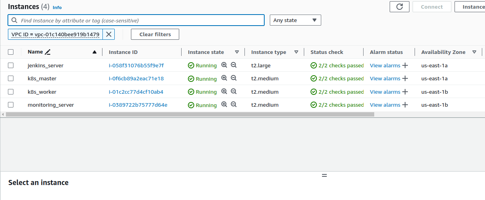
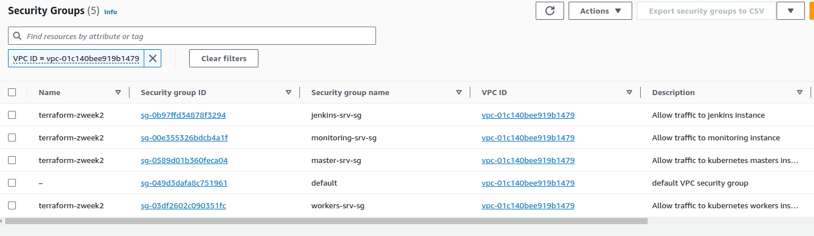
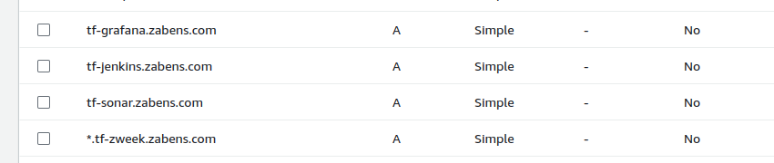

# ZWeeek Challenge Week 2: Global Infra IAC with Terraform & Ansible

## Table of Contents
- [Overview](#overview)
- [Installation](#installation)
- [Conclusion](#conclusion)

## Overview
To efficiently provision our infrastructure and prepare for weekly updates, we've implemented an Infrastructure as Code (IAC) approach using **Terraform & Ansible**. The project structure separates configuration into two main folders: [Ansible](./ansible/README.md) and [Terraform](./terraform/README.md).

## Installation

Before configuring the project, ensure the following tools are installed:
- [AWS CLI](https://docs.aws.amazon.com/cli/latest/userguide/getting-started-install.html)
- [Ansible Installation Guide](https://docs.ansible.com/ansible/latest/installation_guide/intro_installation.html)
- [Terraform Installation Guide](https://learn.hashicorp.com/tutorials/terraform/install-cli)

**Setup AWS CLI Access Locally (Access Key and Secret Key)**

For an optimal development experience, consider using IDE extensions/plugins for tools like VS Code or IntelliJ IDEA.

Search for **Ansible** and **Terraform** Extensions/Plugins

### Installation Steps
#### Step 0: Set AWS CLI Environment Variables
Refer to the [AWS Provider Documentation](https://registry.terraform.io/providers/hashicorp/aws/latest/docs#environment-variables) for guidance.

#### Step 1: Update Variables
Update environment and project variables as required by referring to each project directory: [Ansible](./ansible/README.md) and [Terraform](./terraform/README.md).

#### Step 2: Deploy Infrastructure with Terraform
- Navigate to the [`/terraform`](./terraform/README.md) directory and execute the following commands if Step 1 is completed:
    - `terraform plan` to preview resources to be provisioned.
    - `terraform apply` to apply configurations.

> Upon successful provisioning, check output information for **Private and Public IP** addresses of provisioned EC2 instances.

#### Step 3: Configure Servers with Ansible
- Navigate to the [`/ansible`](./ansible/README.md) directory and if both Step 1 and Step 2 are completed:
    - Populate all output information in respective files:
        - Private IP in host-vars files.
        - Public IP in each instance's `ansible_host` variable.
    - Execute `ansible-playbook -i inventory.ini main-playbook.yml`.

## Conclusion
> Remember to deactivate all resources once done with the infrastructure to avoid unnecessary costs.

